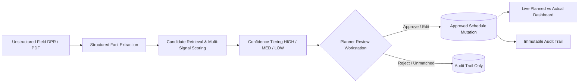

# PRAGATI AI — Planning-to-Execution Intelligence Layer

**Smart India Hackathon 2026** | **Problem Statement:** SIH26122  
**Organization:** Oil India Limited  
**Team:** InfraNexus  

---

## Overview

**PRAGATI AI** is an AI-assisted translation and governance layer that bridges unstructured daily field reports (DPRs, site diaries, spreadsheets, PDFs) to detailed L5/L6 project schedules. 

Planners manually spend hours reconciling fragmented field logs against hundreds of work breakdown activities. PRAGATI AI automates this matching through multi-signal semantic and contextual intelligence while enforcing **strict human planner governance**: AI proposes; the human planner approves, edits, or rejects. No schedule mutation ever occurs silently.



---

## Key Features

1. **Multi-Signal Contextual Matching Engine:**
   Combines semantic similarity (50%), discipline compatibility (15%), entity/equipment matching (15%), location tags (10%), and temporal window checks (10%) with negative contradiction penalties.
2. **Confidence Routing & Governance:**
   - **HIGH:** One-click approval suggestion for decisive winners.
   - **MEDIUM:** Close competition warning requiring human review.
   - **LOW / UNMATCHED:** Safe quarantine with zero schedule mutation.
3. **Split-Screen Planner Workstation:**
   Side-by-side inspection view highlighting grounded source evidence alongside candidate activities and score component meters.
4. **100% Offline / Deterministic Demo Mode:**
   Functions out of the box with zero external API keys or internet connection required, using built-in scikit-learn vector space and deterministic NLP extraction.
5. **Real-Time Analytics & Audit:**
   Interactive S-Curve chart, variance tracking, and complete chronological audit log recording every human and AI decision.

---

## Quick Start (One Command)

### 1. Launch Prototype:
```powershell
python run.py
```
Open your browser and navigate to:  
👉 **`http://127.0.0.1:8000`**

- Interactive Swagger API Docs: `http://127.0.0.1:8000/docs`
- Health Check: `http://127.0.0.1:8000/health`

---

## 3-Minute Demo Walkthrough

1. **Executive Dashboard (`/`):**
   - Review baseline planned progress (68.5%), actual progress (54.2%), and schedule variance (-14.3%).
2. **Ingest DPR:**
   - Click **"Field DPR Ingestion"** tab.
   - Click **"Hero Case"** button to load `DPR-OIL-2026-0308-01.txt`:
     > *"Spool erection near V-105 completed today. 14 spools installed."*
   - Click **"Run Structured Event Extraction & Matching"**.
3. **Inspect & Approve:**
   - In the **"Review Queue"**, click **"Inspect"**.
   - Notice candidate `PIP-L6-0427 — Erect Line 24-inch near V-105` ranked #1 with **HIGH confidence** (score ~74.5%) derived naturally from semantic overlap, location, equipment, and discipline.
   - Click **"Approve Schedule Update"**.
4. **Verify Schedule Mutation:**
   - Check the **"Governance Audit Trail"** for the committed change.
   - Return to the **"Executive Dashboard"** to see updated actual progress and variance.
5. **Test Edge Cases:**
   - Click **"Ambiguous Case"** in ingestion to observe medium-confidence tie handling.
   - Click **"Unmatched Case"** to observe zero schedule mutation on non-schedule entries.

---

## Running Automated Tests & Benchmark

### Run Pytest Test Suite (15/15 Tests Passing):
```powershell
python -m pytest tests/ -v -p no:cacheprovider
```

### Run Ground-Truth Benchmark Evaluation:
```powershell
python scripts/evaluate.py
```
Generates `docs/evaluation.md` with measured Top-1 accuracy, Top-3 recall, and confidence calibration tables.

### Reset Demo Environment to Clean Baseline:
```powershell
python scripts/seed_demo.py
```
Or click the **"🔄 Reset Demo"** button directly in the UI.

---

## Repository Structure

```
Pragati AI/
├── backend/
│   └── app/
│       ├── api/          # REST API endpoints
│       ├── core/         # Settings & matching weights
│       ├── db/           # SQLite / PostgreSQL session
│       ├── models/       # SQLAlchemy models (Activity, Match, AuditLog, etc.)
│       ├── schemas/      # Pydantic boundary schemas
│       ├── services/     # Ingestion, Extraction, Matching, Governance
│       ├── static/       # Enterprise planner UI (HTML, CSS, JS)
│       └── main.py       # FastAPI application
├── data/
│   ├── dprs/             # Sample field progress reports
│   ├── activities.csv    # 165 synthetic L5/L6 activities
│   ├── schedule.csv      # Aliased schedule export
│   ├── wbs.csv           # Work breakdown structure L1-L5
│   └── ground_truth.csv  # Benchmark validation dataset
├── docs/
│   ├── demo-script.md    # 3-5 minute judge walkthrough
│   ├── evaluation.md     # Measured accuracy metrics
│   ├── acceptance-report.md # Acceptance checklist report
│   └── final-mvp-status.md  # Implementation status
├── frontend/             # Standalone UI assets mirror
├── scripts/
│   ├── generate_dataset.py # Synthetic data generator
│   ├── seed_demo.py        # Database seed & reset script
│   └── evaluate.py         # Ground-truth evaluation runner
├── tests/                # Pytest automated test suite
├── .env.example          # Environment template
├── docker-compose.yml    # Container deployment descriptor
├── run.py                # One-command server runner
└── README.md             # Project documentation
```

---

## API Endpoints Reference

| Method | Endpoint | Description |
|---|---|---|
| `GET` | `/health` | Application health and mode status |
| `GET` | `/api/projects` | List active infrastructure projects |
| `GET` | `/api/activities` | Query activities by discipline and status |
| `POST` | `/api/schedules/import` | Upload CSV or XLSX schedule with column alias mapping |
| `POST` | `/api/documents` | Upload field DPR (.txt, .pdf, .csv) |
| `POST` | `/api/extractions/{id}/run` | Run structured event extraction & candidate matching |
| `GET` | `/api/review-queue` | Retrieve pending matches filterable by confidence |
| `GET` | `/api/matches/{event_id}` | Detailed candidate scores breakdown for split inspection |
| `POST` | `/api/matches/{id}/approve` | Commit approved schedule mutation & audit log |
| `POST` | `/api/matches/{id}/edit` | Planner manual activity override & commit |
| `POST` | `/api/matches/{id}/reject` | Reject match suggestion without schedule mutation |
| `GET` | `/api/dashboard/summary` | Real-time planned vs actual metrics & S-curve |
| `GET` | `/api/audit` | Retrieve complete chronological audit trail |
| `POST` | `/api/demo/reset` | Restore clean baseline demo state |
